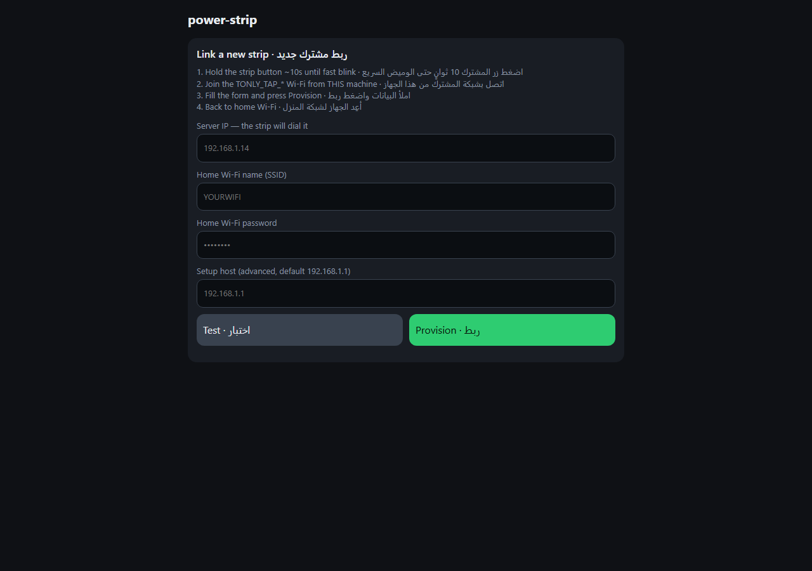
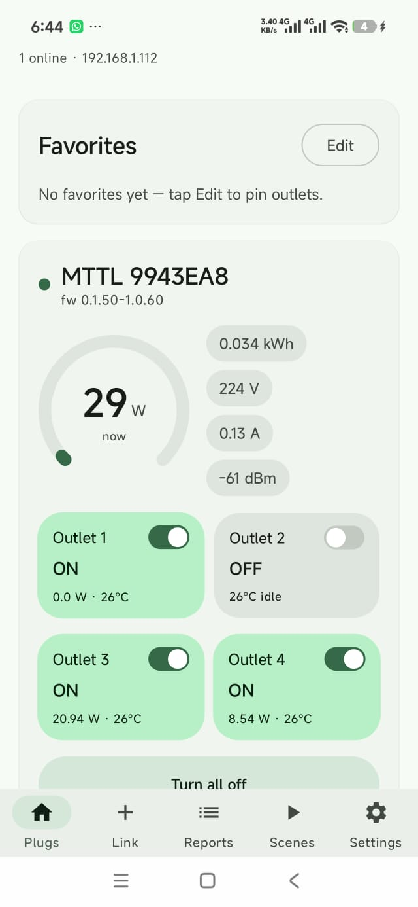
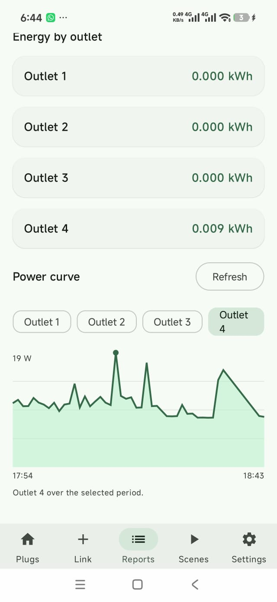
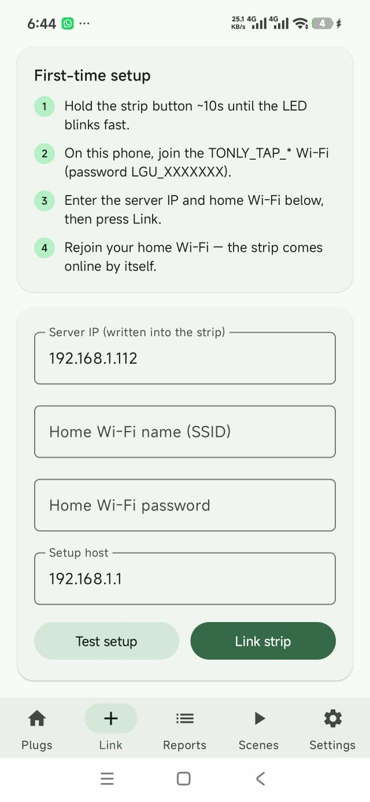

# power-strip

Local control for the LG U+ / Jinheung **MTTL-W01** 4-outlet smart strip — from a
phone, from a PC, from anywhere if you run the server on a VPS.

**English** | [العربية](README.ar.md)

| | |
|---|---|
| Server | `power-strip.py` — one file, Python standard library only |
| App | `android/` — Kotlin + Jetpack Compose, Material 3 Expressive (apk ~12 MB) |
| Protocol | the strip's own `up:...` text protocol over TCP **10086** |
| Needs | no cloud account, no paid app, **no router DNS or DNAT change**, no port forwarding at home, no MQTT, no Home Assistant, no firmware flashing, no Docker |

---

## Screenshots

| Web UI (desktop) | Android app: Plugs + Favorites |
|---|---|
|  |  |

| Android app: Reports | Android app: Link + Rename |
|---|---|
|  |  |

---

## Contents

- [Changelog](CHANGELOG.md)
- [How it works](#how-it-works)
- [What's in here](#whats-in-here)
- [Requirements](#requirements)
- [Step 0 — provision the strip (once, for either mode)](#step-0--provision-the-strip-once-for-either-mode)
- [Mode A — Local (home network only)](#mode-a--local-home-network-only)
- [Mode B — Server (VPS, control from anywhere)](#mode-b--server-vps-control-from-anywhere)
- [Android app (`android/`)](#android-app-android)
- [Web UI and HTTP API](#web-ui-and-http-api)
- [Protocol reference](#protocol-reference)
- [Troubleshooting](#troubleshooting)
- [What this does not do (on purpose)](#what-this-does-not-do-on-purpose)

## How it works

The strip dials a server IP that it stores in its own flash memory. Provisioning
(one time) writes **your server's IP** into the strip; from then on the strip
opens a TCP session to `<server>:10086` and speaks its native line protocol.
`power-strip.py` answers that session, keeps the live state, and serves a web UI + JSON
API. The Android app is just a client of that API.

```
phone / PC browser ──► http://SERVER:8080 ──► power-strip.py ◄── TCP 10086 ── strip
                                                 │
                                            android app (http://SERVER:8080/api/...)
```

Because the strip connects **out**, nothing has to be opened on your home router
and the same server works on your LAN or on a public VPS.

Two ways to run it:

* **Mode A — Local**: `power-strip.py` runs on a PC / Raspberry Pi in your home network.
  Only your home network can reach the UI.
* **Mode B — Server**: `power-strip.py` runs on a VPS with a public IP. The strip dials
  the VPS from home; you control it from anywhere with the token.

Both modes use the same file and the same app.

## What's in here

| Path | What it is |
|---|---|
| `power-strip.py` | the server: TCP 10086 device server, web UI + JSON API, the `provision` command, `selftest` |
| `android/` | Android app source (`gradlew assembleDebug`) |
| `README.md` / `README.ar.md` | this document, English / Arabic |

## Requirements

* LG U+ / Jinheung **MTTL-W01** strip (stock firmware is fine — tested on `0.1.54-1.0.66`)
* 2.4 GHz Wi-Fi network for the strip (the strip does not support 5 GHz)
* A machine that stays on: PC, Raspberry Pi, or a VPS
* Python 3.8+ on that machine (no `pip install`, nothing else)
* A phone (Android app) or any browser

---

## Step 0 — provision the strip (once, for either mode)

Provisioning tells the strip two things: which Wi-Fi to join, and which server IP
to dial. It is done over the strip's own setup access point.

1. **Start the server** on the machine that will stay on and note the IP it prints:

   ```bash
   python power-strip.py
   ```

   ```
   power-strip
     web UI (phone/PC)  http://192.168.1.14:8080
     strip server       TCP 10086
     auth               NONE - only safe on a trusted LAN
   ```

2. **Put the strip in setup mode**: hold its main button ~10 s, until the LED
   blinks fast.

3. **Join the strip's Wi-Fi** from the machine that runs `provision`:
   network `TONLY_TAP_XXXXXXX`, password `LGU_XXXXXXX` — the same 7 characters
   that follow `TONLY_TAP_`. No internet on that network is normal.

4. **Provision it** — use the IP from step 1 (Mode A) or your VPS public IP (Mode B):

   ```bash
   python power-strip.py provision --ip 192.168.1.14 --ssid "YOURWIFI" --password "YOURWIFIPW"
   ```

   Expected output:

   ```
     up:ip:ip_ok
     up:connect:connect_ok
   ```

   The strip's protocol cannot carry `:` or newlines in the SSID/password; the
   command refuses instead of failing silently. `--ip` must be an IPv4 address.

5. **Reconnect that machine to your normal network.** Within seconds the strip
   connects to `<ip>:10086` and appears in the UI.

6. **Verify** on the server (or in its terminal):

   ```
   [device] MTTL 91C0C4C model=lgutap fw=0.1.54-1.0.66
   ```

To move the strip to another server later, repeat step 0 with the new IP — the
strip stores exactly **one** server address.

### If the machine has no Wi-Fi

The server machine never needs Wi-Fi to **run** power-strip — Ethernet is fine, the
strip only has to reach its IP. Wi-Fi is needed once for the provisioning step by
any device that can join `TONLY_TAP_XXXXXXX` and open TCP to `192.168.1.1:30300`:

1. **Android phone, free** — on your home Wi-Fi install
   [Termux](https://f-droid.org/packages/com.termux/), run `pkg install python`,
   download the script with `curl -O http://<server-ip>:8080/power-strip.py`, then join
   the strip's setup network and run the `provision` command above (with the
   *server's* IP).
2. **Any "TCP client" app** — join the strip's network, connect to `192.168.1.1`
   port `30300` and send these two lines, each in its own connection, with CRLF
   line endings:
   ```
   up:ip:<SERVER-IP>                ->  up:ip:ip_ok
   up:connect:<SSID>:<PASSWORD>     ->  up:connect:connect_ok
   ```
3. **USB Wi-Fi dongle (~$10)** on the server machine — then just follow step 0.
4. **A borrowed laptop for two minutes** — download `power-strip.py` from
   `http://<server-ip>:8080/power-strip.py` and run the same command with the
   **server's** IP, not the laptop's.

The bundled `MTTL-W01-Provisioner.apk` cannot do this step: it only stores Wi-Fi
credentials, never a server IP.

---

## Mode A — Local (home network only)

1. On the PC / Raspberry Pi:

   ```bash
   python power-strip.py                 # prints http://<ip>:8080
   ```

   On Windows simply double-click `run-power-strip.bat` (keeps a log window open;
   `run-power-strip.bat 192.168.1.112` pins a fixed IP, `stop-power-strip.bat` stops it).

   To run it as a background service (auto-start at boot, restart on crash,
   no window): double-click `install-service.bat`, approve the admin prompt,
   done — log goes to `power-strip-service.log`. `uninstall-service.bat` removes it.

2. Provision the strip with that IP (step 0 above).

3. Open `http://<ip>:8080` in any browser on the same network — 4 outlet toggles,
   ALL ON/OFF, live watts, kWh, temperature, voltage, Wi-Fi signal.

4. In the Android app: **Settings → Server IP** = that IP, port `8080`, token
   empty → **Save** → **Test** → `Connected · 1 strip(s), 1 online`.

Notes:

* Give the machine a **fixed IP or DHCP reservation** — the strip remembers the
  address you provisioned, so a changed IP means re-running step 0.
* The machine must be awake; the strip reconnects by itself after a sleep, reboot
  or restart of `power-strip`.
* Windows firewall: allow the Python prompt on first run, or
  ```powershell
  netsh advfirewall firewall add rule name="power-strip" dir=in action=allow protocol=TCP localport=8080,10086
  ```

---

## Mode B — Server (VPS, control from anywhere)

The strip dials the VPS from home; you reach the UI from any network.

### 1. Copy the server

```powershell
scp X:\power-strip\power-strip.py ubuntu@<VPS-IP>:~/power-strip/
```

### 2. Run it as a service

```bash
cd ~/power-strip
TOKEN=$(openssl rand -hex 16); echo "YOUR TOKEN: $TOKEN"     # save this
PUB=$(curl -s https://api.ipify.org)                          # your public IPv4
sudo tee /etc/systemd/system/power-strip.service >/dev/null <<EOF
[Unit]
Description=power-strip MTTL-W01 server
After=network-online.target
Wants=network-online.target

[Service]
WorkingDirectory=/home/ubuntu/power-strip
ExecStart=/usr/bin/python3 /home/ubuntu/power-strip/power-strip.py serve --ip $PUB --web-port 7896 --token $TOKEN
Restart=always
RestartSec=3
User=ubuntu

[Install]
WantedBy=multi-user.target
EOF
sudo systemctl daemon-reload && sudo systemctl enable --now power-strip
curl -s -o /dev/null -w 'local code: %{http_code}\n' http://127.0.0.1:7896/     # 401 = running + token active
ss -lntp | grep -E '7896|10086'
```

Adapt `User=` / `WorkingDirectory=` / the port to your setup. `--web-port 7896`
is only an example; `--port 10086` can never change (the strip's firmware dials
10086).

### 3. Open the ports

In your VPS provider's firewall/security group (and in `ufw` if you use it):

| Port | For | Who may reach it |
|---:|---|---|
| **10086/tcp** | the strip | the internet (the strip comes from a dynamic home IP) |
| **7896/tcp** | web UI + API | you — ideally only through a VPN/tunnel, see below |
| 22/tcp | ssh | you |

Verify from your own PC:

```powershell
Test-NetConnection <VPS-IP> -Port 10086
Test-NetConnection <VPS-IP> -Port 7896
```

### 4. Provision the strip with the public IP

At home, follow step 0 with `--ip <VPS-IP>`, then watch the VPS:

```bash
journalctl -u power-strip -f      # [device] MTTL 91C0C4C model=lgutap fw=0.1.54-1.0.66
```

### 5. Use it

* **App**: Settings → host `<VPS-IP>`, port `7896`, token → Save → Test.
* **Browser**: `http://<VPS-IP>:7896/` → login user `power-strip`, password = token
  (or open `http://<VPS-IP>:7896/?t=TOKEN` once).

### Keeping the UI private (optional but recommended)

Port 10086 is fine to expose: control commands only ever travel server → strip,
so a stranger who finds that port cannot switch anything. The **UI port** is the
one that can turn your outlets on and off, so protect it:

* **Token** (`--token`) — required for every page/API call. Without it the UI is
  open to anyone who finds the port.
* **VPN / tunnel** instead of a public port: install
  [Tailscale](https://tailscale.com) on the VPS and on your phone, then use the
  `100.x.y.z` address in the app and keep the web port closed (`ufw allow in on
  tailscale0 to any port 7896 proto tcp`). Nothing is exposed and the traffic is
  encrypted.
* Cleartext HTTP means the token is visible to anyone on the network path. If that
  matters, put your existing nginx/Apache in front as an HTTPS reverse proxy (or
  use the VPN option above).

---

## Android app (`android/`)

```bash
cd android
gradlew assembleDebug            # or: open the folder in Android Studio
```

Install on the phone:

* easiest — with the server running, open `http://<server>:<web-port>/power-strip.apk`
  on the phone (the server serves the built APK; that URL needs no token), or
* download `power-strip.apk` from this repo and install it, or
* `adb install android/app/build/outputs/apk/debug/app-debug.apk`

What you get: an animated splash, a live power ring (watts + energy/voltage/current/RSSI
pills), 4 animated outlet tiles with an in-tile switch, ALL ON/OFF, offline/error
states, Snackbars for failed commands, and a settings screen with server IP, port,
token, a connection Test, and a language switch. The **Link** tab points a new strip
at your server straight from the phone: join `TONLY_TAP_*` on the phone, enter the
server IP + home Wi-Fi, press Link — no PC needed for this step. Tap any strip or
outlet name to rename it (stored on the server, shared with the web UI). The
**Reports** tab shows energy totals, peaks with timestamps and a power curve per
outlet. The **Scenes** tab automates on/off by power threshold, schedule or manual
run. Pin any outlets in custom order in the **Favorites** card on top of Plugs.

Behavior details:

* Polls `/api/state` every 2 s; a press flips the tile immediately and shows a
  spinner in the switch while the strip confirms.
* Commands are blocked per outlet while one is in flight — no toggle storms.
* **Languages**: Arabic + English, following the phone by default; override in
  Settings (also appears in Android's per-app language menu).
* Debug build, no signing setup — fine for personal use, not for the Play Store.

---

## Web UI and HTTP API

| Method | Path | Notes |
|---|---|---|
| GET | `/` | the web UI |
| GET | `/api/state` | `{"local_ip":"…","port":10086,"devices":[{"mac","name","model","fw","online","on","power_w","energy_kwh","voltage","current_a","rssi","outlets":[…]}]}` |
| POST | `/api/onoff` | `{"mac":"…","outlet":0-4,"on":true}` — outlet `0` = all |
| GET | `/api/provision_info` | `{"local_ips","default_ip","setup_host","setup_port"}` — prefill for the Link form |
| GET | `/api/provision_probe?host=` | `{"reachable",…}` — does this machine see the strip setup service? |
| POST | `/api/provision` | `{"server_ip","ssid","password","host"?,"wait"?}` → `{"ok","steps","error"}` — this machine must be on `TONLY_TAP_*` |
| GET | `/api/names` | all custom names `{"names":{mac:{"strip","outlets"}}}` |
| POST | `/api/names` | `{"mac","strip"?,"outlets"?}` — empty clears, missing keys are kept |
| GET | `/api/history?mac=&outlet=&from=&to=&bucket=` | samples `raw` or aggregates `hour`/`day` (outlet `0` = all) |
| GET | `/api/report?mac=&period=` | `today`/`week`/`month`: totals, per-outlet kWh, peak/min power with timestamps |
| GET | `/api/scenes` | list automation scenes |
| POST | `/api/scenes` | `{"name","trigger":{"type":"threshold|schedule|manual",…},"actions":[{"mac","outlet":0-4,"on"}]}` |
| PUT/DELETE | `/api/scenes/{id}` | update / remove a scene |
| POST | `/api/scenes/{id}/run` | run once now (`503` when the device is offline) |
| GET | `/power-strip.py` | the script itself (public) |
| GET | `/power-strip.apk` | the built Android app, if present (public) |

When `--token` is set, every request needs it — any of:

* `X-Token: TOKEN` header (what the app sends)
* HTTP Basic, user `power-strip` + token as password (what the browser does)
* `?t=TOKEN` query parameter

`/power-strip.py` and `/power-strip.apk` stay public on purpose, so a new phone can always
download the app and a machine without Wi-Fi can always download the provisioner.

### Linking from the browser (no terminal)

If the machine running `power-strip.py` has Wi-Fi, step 0 works from the web UI itself:
open `http://<server>:<web-port>/`, scroll to **Link a new strip**, join the
`TONLY_TAP_*` network from that machine, fill in the home SSID/password and press
**Provision**. The same checks as the CLI apply (IPv4 server IP, no `:` or newlines
in SSID/password), the token is required when one is set, and a wrong SSID just
returns `{"ok":false,…}` with the strip's answer instead of failing silently.

## Protocol reference

Wire format the strip speaks on TCP 10086 :

| Direction | Frame |
|---|---|
| strip → server | `up:bootinfo:<model>;<mac>;<mac>;<fw>;connect` |
| strip → server | `up:getinfo:<ch>:<runtime>;<relay on/off>;<state>;<overload>;<overheat>;<power mW>;<energy hex Wh>;<prev hex>;<config hex>;<status>;<event hex>;<temp C>` ×4 |
| strip → server | `up:power_report:<ch>:<mV>` (≥50000) or `:<mA>` |
| strip → server | `up:query:<rssi>` |
| strip → server | `up:event:onoff:<1-4>:on|off` (physical button, `0` = master) |
| server → strip | `up:getinfo:all`, `up:onoff:<1-4>:on|off`, `up:power_report:1:vol`, `up:query:wifirssi` |
| setup AP `192.168.1.1:30300` | `up:ip:<ip>` → `up:ip:ip_ok`, `up:connect:<ssid>:<pw>` → `up:connect:connect_ok` |

There is no `up:onoff:0`; "all" is sent as a loop over outlets 1–4. The device pads
some frames with NUL bytes and the port is fixed at 10086.

## Troubleshooting

| Symptom | Cause / fix |
|---|---|
| `Not reachable` during provision | the machine is not on `TONLY_TAP_*`, or the strip is not in setup mode (hold the button again) |
| App/browser shows no strip | strip must be on 2.4 GHz; the provisioned IP must still be the server's IP; watch the `[device]` lines in the server output / `journalctl -u power-strip -f` |
| Worked, then stopped | server IP changed, machine slept, or the strip moved to another network → re-provision (step 0) |
| Strip flaps: connects then drops | some firmware chatter is normal, the strip re-dials; if it never stabilises, check Wi-Fi signal (`rssi`) and that only one `power-strip` is running |
| `bad request` from the API | an older app build sent an empty body — update the APK |
| App crashes at launch | update to the latest APK (older builds had an outlet-index crash) |
| UI unreachable but 10086 works | the web port is not open, or you are on a network that cannot reach the VPS |
| Nothing responds at all | `python power-strip.py selftest` proves the server logic without any hardware |

## What this does not do (on purpose)

MQTT/Home Assistant entities, Matter, firmware OTA, multi-user
accounts. Add them when you actually want them.

